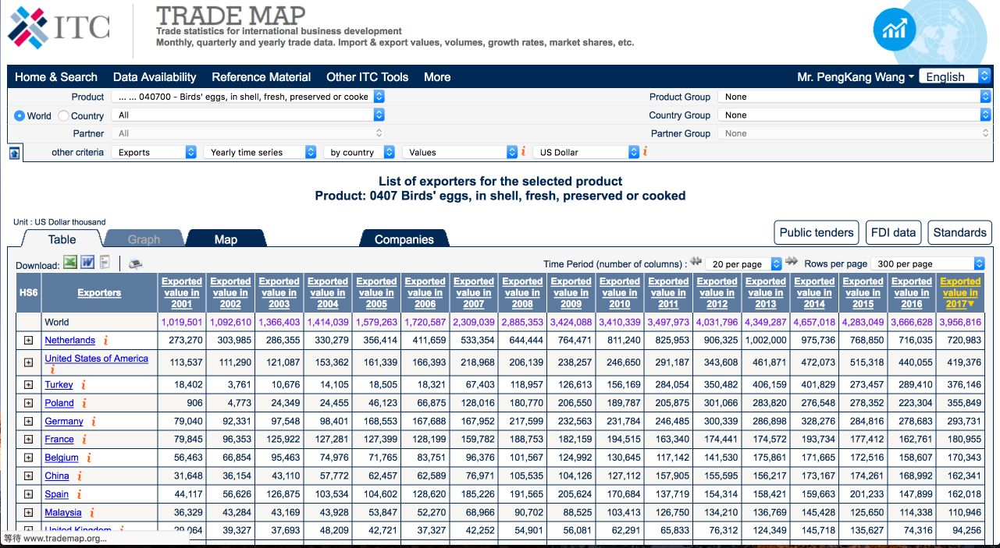
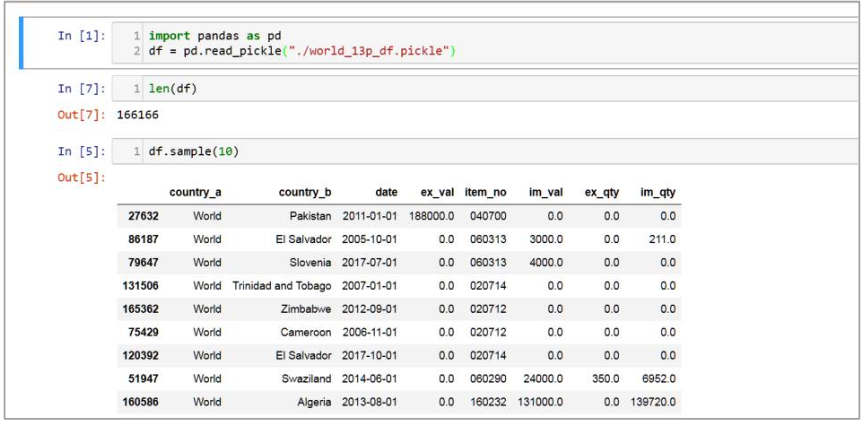

# ITC_TradeMap

1. 爬蟲
2. 解析HTML
3. 將資料整理轉成Json 
4. 在GCP APP Engine 上部署API

## 主程式
Step | Work | Code
---|:---:|---
1|爬蟲|spider.py
2|解析 HTML|parser.py
3|DataFrame 格式轉換成json| toJson.py


## 爬蟲
- 目標網站: https://www.trademap.org/Country_SelProduct_TS.aspx   
- 網站敘述: ITC Trade Map 資料庫, 包含世界各國的農產品進出口紀錄   
- 爬蟲要求: 下載特定品項的每月進出口值、量  
1. Use Python Selenium package  
2. 登入會員才能選取到題目要求的品項

(1) Products = [
"020711 - Fresh or chilled fowls of the species Gallus domesticus, not cut in pieces" "020712 - Frozen fowls of the species Gallus domesticus, not cut in pieces" "020714 - Frozen cuts and edible offal of fowls of the species Gallus domesticus" "040700 - Birds' eggs, in shell, fresh, preserved or cooked"]
(2) Countries = "World"
(3) Records = ["Exports", "Imports"]
(4) Timeseries = "Monthly time series"
(5) Indicators = ["Values", "Quantities"]
(6) Time Period (number of columns) = "20 per page"
(7) Rows per page = "300 per page"
(8) ...其餘為網站預設值

  


## Install
```
sudo pip install -r requirement.txt
```
## Web Driver
- firefox 64.0, geckodriver v0.23.0  

需要安裝相對應OS的driver與firefox，這邊裝的是mac版 geckodriver有要求相對應firefox 的版本與 Selenium的版本，通常是最新的就比較沒有問題
```
wget https://github.com/mozilla/geckodriver/releases/download/v0.23.0/geckodriver-v0.23.0-macos.tar.gz
tar -zxvf geckodriver-v0.23.0-macos.tar.gz
```

- phantomjs 2.1.1

使用anaconda 的安裝套件安裝
```
conda install -y -c conda-forge phantomjs
```

## Docker
```
docker build -t itc_trade_spider:latest -f Dockerfile .
docker run itc_trade_spider
```

## Quick test
```
python spider.py
python parser.py
python toJson.py
check.ipynb
```
## GCP API 
https://itc-map-result.appspot.com/map_result

## Run
```
python run.py
```


## Output
```
df_all.pickle
map_result.json
```


